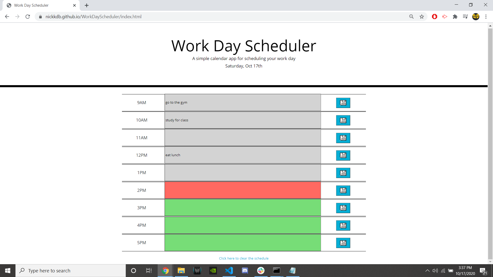

# WorkDayScheduler

https://nickkdb.github.io/WorkDayScheduler/

I built this project using CSS, HTML, and JS

CSS- CSS was mostly provided, but I made some basic changes to fit my version of
this project better. Most of the CSS I added was positioning, alignment, and
hover stylings.

HTML - The HTML is entirely hardcoded and then referenced within the javascript
file. I created a p tag to contain the current day, as well as columns and rows
using bootstrap grid to separate the timestamp, text block, and save buttons.

JS- The JS begins by running the main() function, which loops through each textbox
and if there is a local storage key that matches the textbox's id, their values are  
set equal to eachother. It then calls the schedulecolor() function. This function pulls the current time from the moment.js source, and then
loops through each textbox's corresponding time to see if it is in the past,
present, or future. A class is then assigned to the textboxes to color code them 
based on those 3 parameters. 

